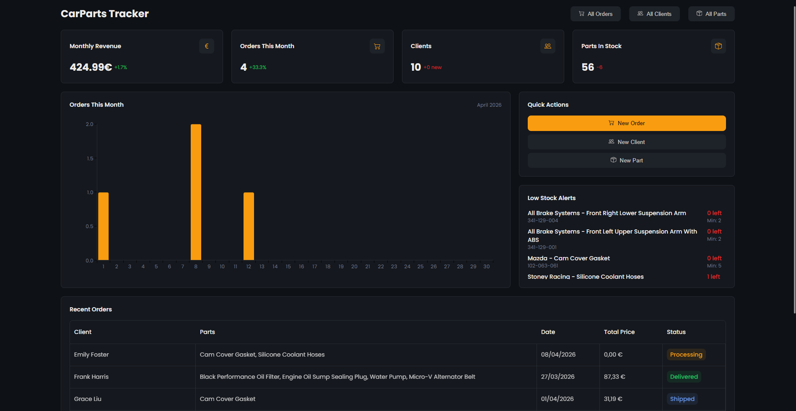
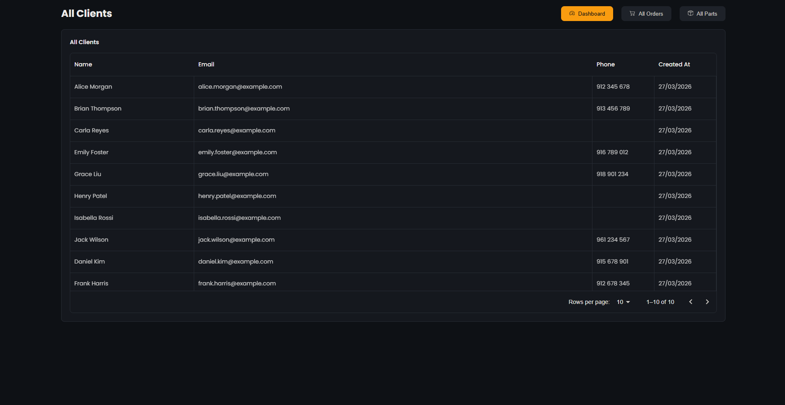
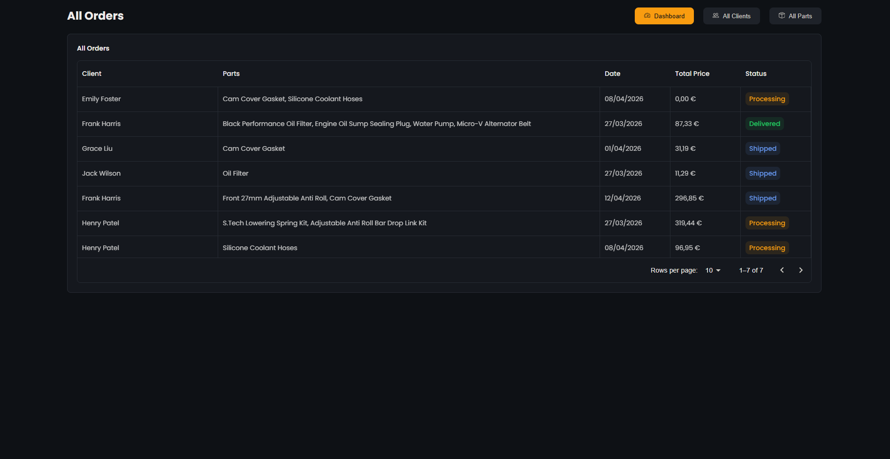
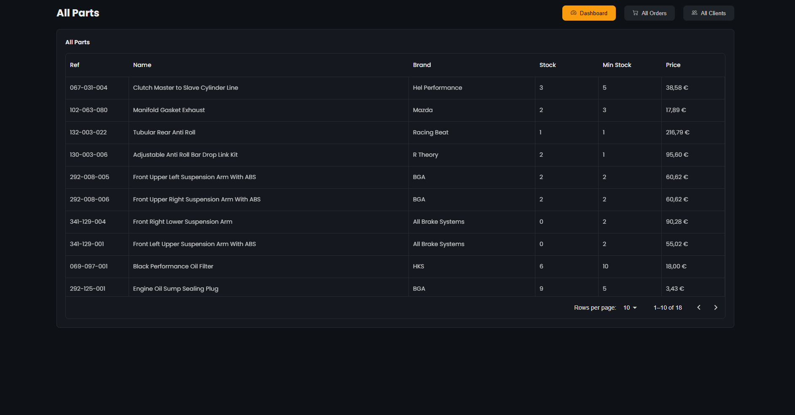
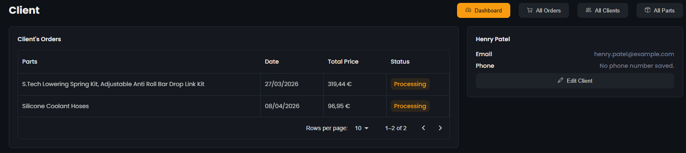
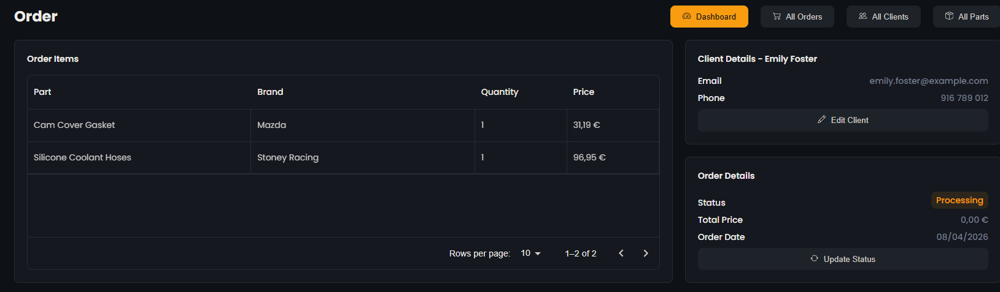
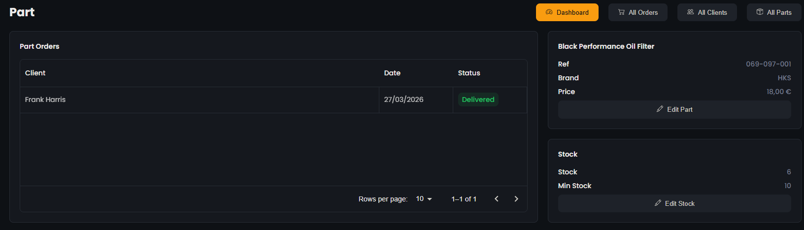

# 🚗 CarParts Tracker

A full-stack inventory and order management dashboard for car parts businesses, designed to simplify stock tracking, client management, and sales monitoring.

Built with React and modern UI tools, focused on delivering a fast and intuitive business management experience.
Manage clients, inventory, and orders in one centralized system with real-time updates and structured data tracking.

## 🌐 Tech Stack
- Frontend: React + Vite
- UI: MUI (X Data Grid, X Charts, Material UI)
- Backend/Database: Supabase
- Routing: React Router DOM
- Extras: React Select, React Icons

## ✨ Features
### Client Management
- Create client profiles (name, email and phone number)
- View all clients in a data grid
- Edit client information
- View client-specific orders

### Parts Management
- Create parts (reference, name, brand, price, minimum stock and current stock)
- View all parts in a data grid
- Edit part details
- Track stock levels
- Low stock alerts

### Order System
- Create new orders
    - Select client
    - Add multiple parts and quantities
    - Automatic total price calculation
- Order status tracking (Processing, Shipped, Delivered)
- View all orders in a data grid
- View and edit order details

### Dashboard & Analytics
- Orders this month
    - Bar chart showing daily order count
- Monthly Revenue
    - Total revenue for the month
    - Percentage comparison with previous month
- Total orders this month
    - Total number of orders
    - Monthly comparison
- Clients Growth
    - Total clients
    - New clients this month
- Stock changes
    - Total number of parts
    - Parts added/removed this month
- Low Stock Alerts
    - Highlights parts below minimum stock or out of stock
- Recent Orders
    - Quick access data grid with client, parts, date, total price and status

## 📸 Application Preview
### Dashboard

### Pages Overview

### Detailed Pages

## 📄 Pages Overview
### Clients Page
- View and manage all clients

### Orders Page
- View and manage all orders

### Parts Page
- View and manage all parts

## 🔍 Detailed Views
### Client Details
- Editable client information
- List of all orders made by the client

### Order Details
- Parts included in the order
- Editable client information
- Status update
- Total price and order date

### Part Details
- Editable part details
- Stock management
- Orders containing this part

## 📌 Future Improvements
- Authentication & User roles
- Notifications system
- Export reports (PDF, CSV)
- Mobile optimization
- Import clients, parts and orders
- Add car model category to parts and clients
